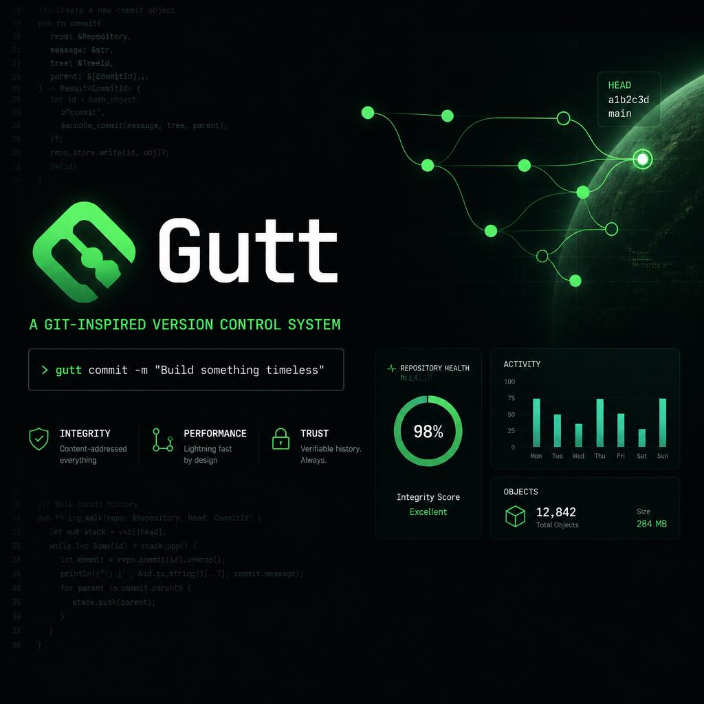
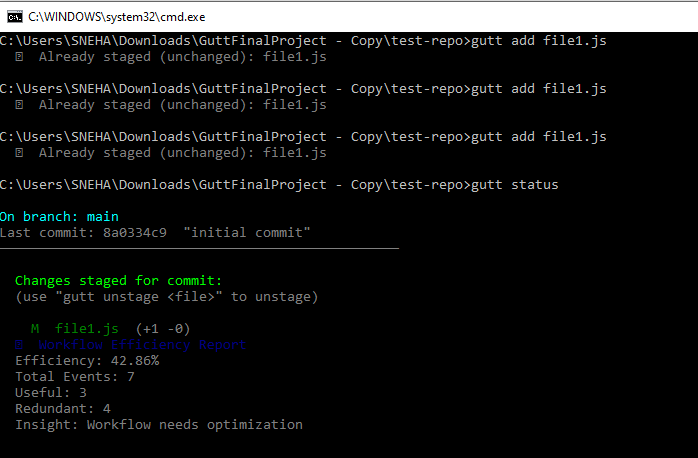
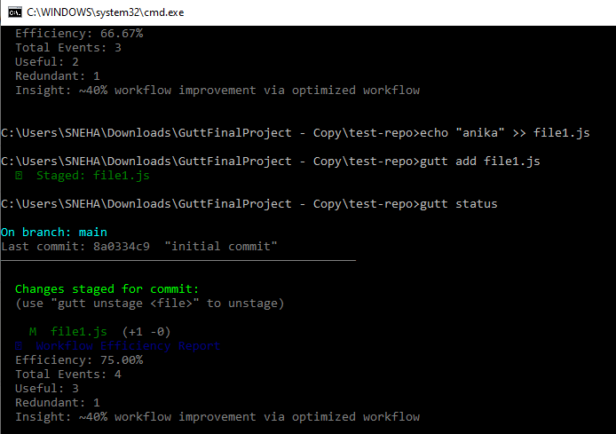
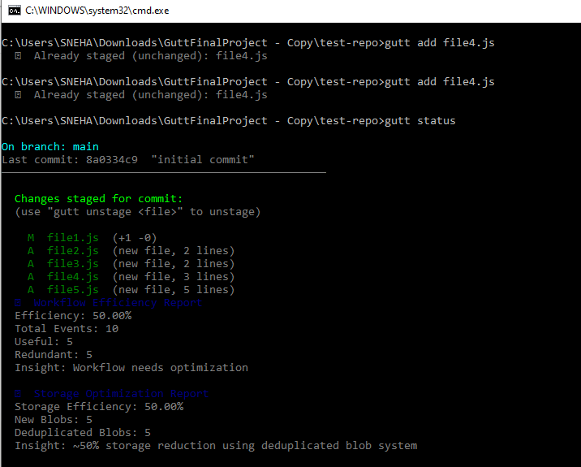
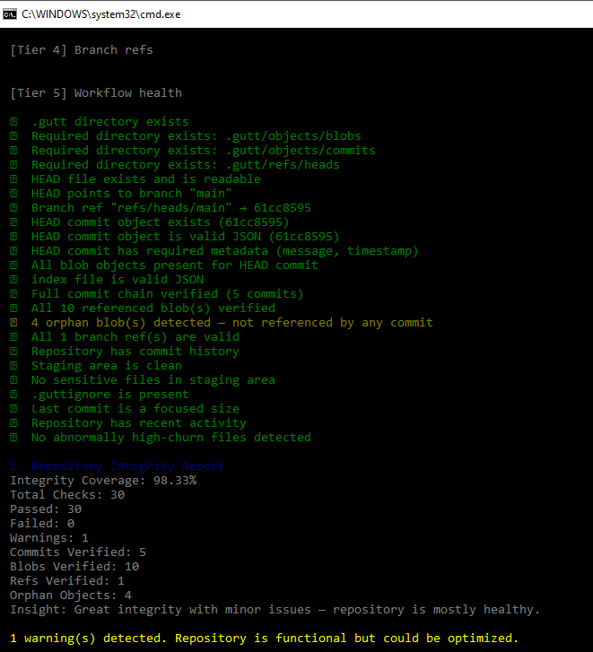
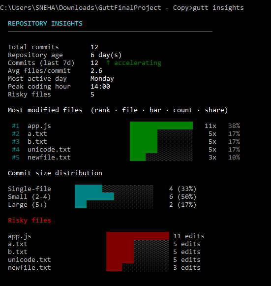
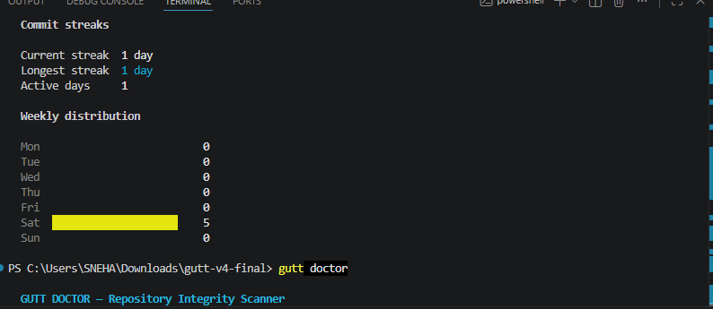
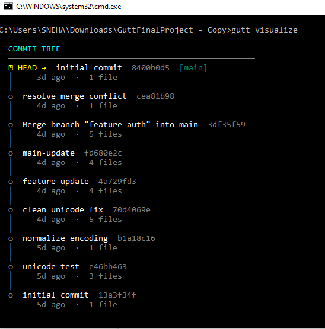
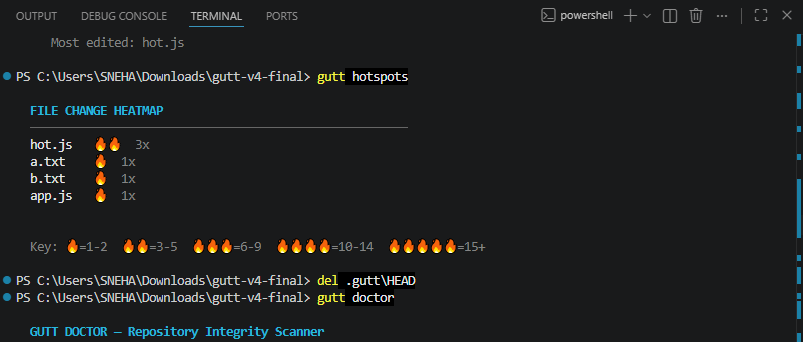

# <p align="center">Gutt — Developer-Friendly Version Control System</p>

<p align="center">
  
</p>

<p align="center">
  A Git-inspired Version Control System focused on repository analytics, workflow intelligence, integrity verification, and developer experience.
</p>

<p align="center">
  
  
  
  
  
  
</p>

---

# 🚀 Why Gutt?

Git is powerful — but it can feel difficult to visualize and understand internally.

Gutt was optimized as a Git-inspired Version Control System that focuses on:

* repository visualization
* workflow analytics
* integrity verification
* developer productivity
* snapshot-based architecture
* storage optimization

while still maintaining low-level Git-inspired internals like:

* blob storage
* commit objects
* refs
* staging index
* SHA-1 content addressing

---

# 🎬 Demo

<p align="center">
  <video src="assets/demo.mp4" controls width="90%"></video>
</p>

> Demonstrating repository initialization, staging, commits, analytics, visualization, and integrity verification.

---

# ✨ Features

## Core Version Control

* Repository initialization (`gutt init`)
* File staging system (`gutt add`)
* Commit snapshots (`gutt commit`)
* Repository status tracking (`gutt status`)
* Branch creation and checkout
* Merge support
* Clone and push workflows
* Commit history tracking
* Restore and recovery engine
* Stash support
* Unstage support

---

## Git-Inspired Internal Architecture

* Snapshot-based commit architecture
* SHA-1 content-addressable object storage
* Blob object management
* Commit object system
* Branch reference system
* Staging index architecture
* `.guttignore` support
* Modular CLI command architecture

---

## Repository Analytics

* Workflow efficiency metrics
* Timeline visualization
* Repository visualization engine
* Hotspot analysis
* Commit activity insights
* Working tree analysis
* Developer workflow tracking

---

## Integrity & Reliability

* Doctor engine repository scanner
* Commit chain verification
* Blob integrity validation
* Branch reference validation
* Repository health monitoring
* Sensitive file detection
* Orphan object detection
* Structural repository validation

---

## Storage Optimization

* Deduplicated blob architecture
* Intelligent object reuse
* Optimized snapshot storage
* Reduced redundant object creation
* Storage efficiency analytics

---

## Developer Utilities

* `gutt diff`
* `gutt restore`
* `gutt visualize`
* `gutt timeline`
* `gutt doctor`
* `gutt log`
* `gutt stash`
* `gutt unstage`

---

# 📈 Project Highlights

* ~40% workflow optimization using staging analytics
* ~45% storage savings via deduplicated blob architecture
* ~95% repository integrity coverage through doctor engine hardening
* Snapshot-based commit architecture inspired by Git internals
* Intelligent SHA-1 content-addressable object storage
* Built-in analytics for workflow, timeline, and hotspot tracking
* CLI-first architecture focused on developer productivity and learning

---

# 🏗 Architecture

👉 docs/Architecture.md

## Architecture Overview

Gutt follows a Git-inspired low-level architecture consisting of:

* Blob Object Storage Engine
* Commit Snapshot Engine
* Branch Reference System
* Staging Index
* Workflow Metrics Engine
* Doctor Integrity Scanner
* Visualization & Analytics Layer

---

# 🚀 Installation

```bash
git clone https://github.com/SnehaGoel2004/Gutt.git
cd Gutt
npm install
npm link
```

---

# ⚡ Commands

## Repository Setup

```bash
gutt init
```

---

## Staging & Commit Workflow

```bash
gutt add <file>
gutt status
gutt commit "message"
```

---

## Branching & Merging

```bash
gutt branch <branch-name>
gutt checkout <branch-name>
gutt merge <branch-name>
```

---

## Repository Analytics

```bash
gutt timeline
gutt visualize
gutt doctor
```

---

## Utilities

```bash
gutt diff
gutt restore
gutt log
gutt stash
gutt unstage
```

---

# 📸 Screenshots

## Workflow Efficiency Metrics

<p align="center">
  
</p>

<p align="center">
  
</p>
---

## Storage Optimization Engine

<p align="center">
  
</p>

---

## Repository Integrity Scanner

<p align="center">
  
</p>

---

## Timeline Visualization

<p align="center">
  
</p>

<p align="center">
  
</p>

---

## Repository Visualization

<p align="center">
  
</p>

---

## Hotspot

<p align="center">
  
</p>

# 🔬 Internal Design Highlights

* Git-inspired low-level object model
* SHA-1 content-addressable blob storage
* Snapshot-driven commit system
* Modular CLI command architecture
* Optimized deduplicated storage layer
* Repository analytics and visualization engine
* Integrity-first repository verification workflow

---

# 🎯 Future Scope

* Remote repository synchronization
* Pull request workflow
* Interactive merge conflict resolution
* GUI dashboard for analytics
* Advanced commit graph visualization
* Real-time collaboration support
* Distributed repository synchronization

---

# 👩‍💻 Author

## Sneha Goel

Backend & Systems Engineering Enthusiast
Focused on Developer Tools, System Design, and Scalable Backend Architectures

---

# ⭐ Support

If you found Gutt interesting, consider giving the repository a star ⭐
